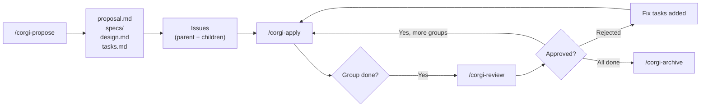
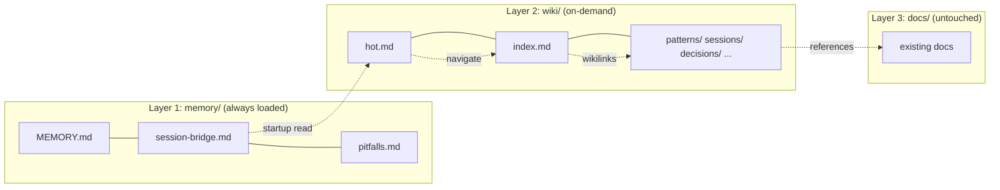

**English** | [繁體中文](README.zh-TW.md)

# OpenSpec GitFlow

Turn AI coding assistants into structured engineering workflows — with schema-driven planning, checkpoint-based implementation, and full issue tracking on GitLab or GitHub.

## What This Is

This project is a **community extension** of [OpenSpec](https://github.com/Fission-AI/OpenSpec) — an open-source CLI by [Fission AI](https://github.com/Fission-AI) for managing change artifacts (proposals, specs, designs, tasks) in AI-assisted development workflows.

OpenSpec provides the core CLI (`openspec init`, artifact pipeline, change lifecycle). **We built custom schemas and skills on top of it** to add:

- **Issue tracking** — Parent/child issues created automatically on GitLab (`glab`) or GitHub (`gh`)
- **Checkpoint-based apply:** Executes one Task Group at a time, syncs closeout state, then pauses for review
- **Interactive review cycle:** Gathers review evidence, asks for an explicit decision, then applies the transition the user approved
- **Progress sync** — Rich summaries posted to issues (objectives, completion, files produced)
- **Workflow labels** — State machine: `backlog → todo → in-progress → review → done`
- **Git worktree isolation** — Run multiple changes in parallel, each in its own worktree (opt-in)
- **Project-local installer** — OpenCode and Claude Code are supported in installer v1
- **Composable skill hierarchy** — Skills are structured as Atoms → Molecules → Compounds with machine-readable metadata, validated by the `ds-skills` CLI



This diagram shows the command handoff points only. Inside that flow, `/corgi-propose` finishes by closing out into a tracked handoff state, `/corgi-apply` runs one Task Group through implementation and closeout before it stops, and `/corgi-review` gathers evidence before it asks for an explicit decision and applies the transition the user approved.

## Quick Start

### Prerequisites

- **Node.js 18+** (for `corgispec`)
- **OpenCode** or **Claude Code**
- **glab CLI** ([install](https://gitlab.com/gitlab-org/cli)) — required for `gitlab-tracked`
- **gh CLI** ([install](https://cli.github.com/)) — required for `github-tracked`
- At least one of `glab` or `gh` is needed for issue-tracking features.

### 1. Build `corgispec`

```bash
git clone https://github.com/ricoyudog/openspec_gitflow_modified.git
cd openspec_gitflow_modified/packages/corgispec
npm install
npm run build
```

### 2. Install to your project

Copy and paste the following prompt into your LLM Agent (OpenCode, Claude Code, Cursor, etc.):

```text
Fetch and follow instructions from https://raw.githubusercontent.com/ricoyudog/openspec_gitflow_modified/main/.opencode/INSTALL.md
```

If you are using a branch or tag instead of `main`, replace `main` in that URL with the same checked-out ref so the fetched dispatcher matches your local repo contents.

That dispatcher tells the agent to run `corgispec bootstrap --target /path/to/project --mode auto`, optionally adding `--schema <schema>` if you already provided one.

### 3. Review the bootstrap report

Bootstrap writes `openspec/.corgi-install-report.md` in the target project and the agent should summarize whether it succeeded, stopped, or failed.

### 4. Start using the workflow in the target project

After bootstrap finishes, open the **target project** in OpenCode or Claude Code and start the workflow:

```text
# OpenCode
/corgi-propose Add user authentication with JWT and refresh tokens

# Claude Code
/corgi:propose Add user authentication with JWT and refresh tokens
```

This generates all planning artifacts, writes the local tracked handoff state, and mirrors it to parent/child issues. After that, `/corgi-apply` runs one Task Group and its closeout, then stops for `/corgi-review`, which gathers evidence, asks for an explicit decision, and applies the transition the user approved. Then use the assistant-specific command form:

- OpenCode: `/corgi-apply`, `/corgi-review`, `/corgi-archive`, `/corgi-explore`
- Claude Code: `/corgi:apply`, `/corgi:review`, `/corgi:archive`, `/corgi:explore`

> **Platform detection**: All `/corgi-*` commands auto-detect GitLab or GitHub from your `config.yaml`. Same commands, either platform.

## Install / Update / Verify Workflow

Use the quick start above for new onboarding. The sections below are lower-level installer reference material for explicit install, update, verify-only, and legacy-migration cases.

### Legacy manual install flow

If you need to run the older explicit install flow instead of bootstrap, start here.

### 1. Initialize OpenSpec in the target project

```bash
cd /path/to/your-project
openspec init
```

### 2. Run the installer from the cloned repo

Open the cloned `openspec_gitflow_modified` repo in **OpenCode** or **Claude Code** and run the installer command.

Examples:

```text
# OpenCode
/corgi-install --mode fresh --path /path/to/your-project

# Claude Code
/corgi:install --mode fresh --path /path/to/your-project
```

If you omit flags, the installer prompts for the target path, schema, and whether to enable worktree isolation.

The installer assumes the required user-level skills are already present. If bootstrap could not provision them, run `./install-skills.sh` from the cloned repo before retrying this manual path.

### 3. Answer the installer prompts

- **Target project path** — where `openspec init` already ran
- **Schema** — choose `gitlab-tracked` or `github-tracked`
- **Worktree isolation** — explicit opt-in only; never enabled automatically

The installer copies only the project-local managed fileset into the target project:

- `.opencode/commands/corgi-*.md`
- `.claude/commands/corgi/*.md`
- `openspec/schemas/{selected-schema}/**`

It then patches only installer-owned keys in `openspec/config.yaml` and records the install state in:

- `openspec/.corgi-install.json`
- `openspec/.corgi-install-report.md`
- `openspec/.corgi-backups/<timestamp>/` when a legacy install backup is needed

### 4. Review the verification report

Every install, update, and verify-only run writes `openspec/.corgi-install-report.md` in the target project.

Review it before continuing. The report records:

- prerequisite checks (`openspec`, `gh`, `glab`)
- user-level skill checks (`~/.claude/skills/corgispec-*`, `~/.config/opencode/skill/corgispec-*`)
- schema and `openspec/config.yaml` checks
- managed fileset sync results
- PASS/FAIL status
- whether any mutations were performed

### 5. Configure additional project context (optional)

The installer manages only the `schema` field and installer-owned `isolation` keys in `openspec/config.yaml`.

You can then add project-specific `context` and `rules` manually:

```yaml
# REQUIRED: which schema to use
schema: gitlab-tracked   # or github-tracked

# RECOMMENDED: worktree isolation
# Each change gets its own git worktree + feature branch.
# propose/apply/review/archive all run inside the worktree.
# Without this, all changes share the same working directory.
isolation:
  mode: worktree           # worktree | none (default: none)
  root: .worktrees         # worktree root directory (default: .worktrees)
  branch_prefix: feat/     # feature branch prefix (default: feat/)

# OPTIONAL: project context for AI
# Guides artifact generation (proposal, specs, design).
context: |
  Tech stack: TypeScript, Next.js 14, Prisma, PostgreSQL
  We use conventional commits and Prettier
  Domain: e-commerce platform

# OPTIONAL: per-artifact rules
rules:
  proposal:
    - Keep proposals under 500 words
  tasks:
    - Max 2 hours per task
    - Each Task Group should be independently deployable
```

> **Why enable worktree isolation?** Without it, all changes share your main checkout — you can only work on one change at a time, and code changes mix with your main branch. With worktrees, each change is isolated in its own directory with its own feature branch. On archive, the worktree is cleaned up but the branch is preserved for you to merge via MR/PR.

The installer supports four explicit modes.

### Fresh install

Use this when the target project has no managed files and no `openspec/.corgi-install.json` manifest yet.

- requires user-level `corgispec-*` skills to already exist under `~/.claude/skills/` and `~/.config/opencode/skill/`
- copies the managed fileset into project-local `.opencode/`, `.claude/`, and `openspec/schemas/`
- patches `openspec/config.yaml` minimally
- asks whether to enable worktree isolation
- writes `openspec/.corgi-install.json` and `openspec/.corgi-install-report.md`

### Managed update

Use this when the target project already has `openspec/.corgi-install.json`.

```text
/corgi-install --mode update --path /path/to/your-project
```

The installer compares the current managed files against the manifest hashes before updating.

### Managed update with local modifications

If the installer finds **local modifications** in a manifest-managed file, it does **not** overwrite it.

Instead, it:

- prints a diff
- stops the update
- writes FAIL status to `openspec/.corgi-install-report.md`
- asks you to resolve the local modifications manually before retrying

### Verify-only

Use verify-only when you want a health check without any file mutations:

```text
/corgi-install --mode verify --path /path/to/your-project
```

Verify-only checks prerequisites, user-level skill availability, managed fileset integrity, schema presence, and `openspec/config.yaml`, then writes `openspec/.corgi-install-report.md`.

### Legacy install migration

If managed files already exist but the target project has no `openspec/.corgi-install.json` manifest, the installer classifies the project as a **legacy install**.

In that case it:

- reports the legacy classification clearly
- creates `openspec/.corgi-backups/<timestamp>/`
- asks for explicit approval before migration
- aborts without overwriting if you decline

For the full agent-executable validation scenarios covering fresh install, managed update, local modifications, verify-only, legacy install, and worktree prompting, see `.sisyphus/plans/corgi-install-smoke-matrix.md`.

## Commands

| Command | What it does |
|---------|-------------|
| OpenCode `/corgi-install` / Claude `/corgi:install` | Legacy/manual-only installer path for project-local asset install, update, or verify |
| OpenCode `/corgi-propose` / Claude `/corgi:propose` | Generate planning artifacts, then close out into tracked handoff state |
| OpenCode `/corgi-apply` / Claude `/corgi:apply` | Execute one Task Group, sync closeout state, then stop for review |
| OpenCode `/corgi-review` / Claude `/corgi:review` | Gather evidence, ask for an explicit decision, then apply the transition the user approved |
| OpenCode `/corgi-archive` / Claude `/corgi:archive` | Close all issues, sync delta specs, extract long-term knowledge, clean up |
| OpenCode `/corgi-explore` / Claude `/corgi:explore` | Thinking partner — explore ideas, check issue feedback, clarify requirements |
| OpenCode `/corgi-memory-init` / Claude `/corgi:memory-init` | Initialize the 3-layer memory structure (`memory/` + `wiki/`) for cross-session continuity |
| OpenCode `/corgi-migrate` / Claude `/corgi:migrate` | Import existing knowledge (docs, archived changes, vault pages) into memory/wiki |
| OpenCode `/corgi-lint` / Claude `/corgi:lint` | Validate memory health — freshness, size caps, broken links, extraction completeness |
| OpenCode `/corgi-ask` / Claude `/corgi:ask` | Answer questions from the vault using budget-aware retrieval |

## Configuration

All project-level config lives in `openspec/config.yaml`. The installer updates only the `schema` field and installer-owned `isolation` keys. Add `context` and `rules` after installation as needed.

### Worktree Isolation (opt-in)

Run multiple changes in parallel, each in its own git worktree:

```yaml
isolation:
  mode: worktree    # worktree | none (default: none)
  root: .worktrees  # default: .worktrees
  branch_prefix: feat/  # default: feat/
```

When enabled, `/corgi-propose` (OpenCode) or `/corgi:propose` (Claude Code) creates a worktree automatically. All subsequent commands (`apply`, `review`, `archive`) operate inside it. On archive, the worktree is cleaned up but the branch is preserved for you to merge.

## Cross-Session Memory

AI sessions are stateless by default. OpenSpec GitFlow adds a **3-layer memory system** — ≤2900 tokens at startup, self-compacting, Obsidian-compatible.



| Scenario | Command |
|----------|---------|
| New project bootstrap | Paste the Quick Start prompt into your agent — it runs `corgispec bootstrap` |
| Add memory to existing project | `/corgi-memory-init` |
| Migrate existing KB into memory | `/corgi-migrate` |
| Health check | `/corgi-lint` |

**[Full documentation: Architecture, Lifecycle, Migration, Obsidian →](docs/cross-session-memory.md)**

## Schemas

A schema defines the artifact pipeline — what documents to create, in what order, and what the apply phase tracks.

### Bundled Schemas

Both `gitlab-tracked` and `github-tracked` produce the same 4-artifact pipeline:

| Artifact | File | Description |
|----------|------|-------------|
| Proposal | `proposal.md` | Motivation, scope, capabilities, impact |
| Specs | `specs/<capability>/spec.md` | Formal requirements with WHEN/THEN scenarios (one per capability) |
| Design | `design.md` | Technical decisions, architecture, risks, trade-offs |
| Tasks | `tasks.md` | Numbered Task Groups with checkboxes — each group becomes a child issue |

Pipeline: `proposal → specs → design → tasks → apply`

Key design decisions:
- **Capabilities-driven specs** — The proposal declares capabilities; each becomes a separate spec file, creating a traceable contract.
- **Delta spec model** — Specs use ADDED/MODIFIED/REMOVED/RENAMED operations so changes accumulate into canonical specs over time.
- **Task Groups as checkpoint units** — Each `## N. Group Name` in `tasks.md` = one child issue, one apply session, one review cycle.

### Creating a Custom Schema

<details>
<summary>Expand</summary>

Create a directory under `openspec/schemas/`:

```
openspec/schemas/my-schema/
├── schema.yaml
└── templates/
    ├── proposal.md
    └── tasks.md
```

Define `schema.yaml`:

```yaml
name: my-schema
version: 1
description: Lightweight workflow with proposal and tasks

artifacts:
  - id: proposal
    generates: proposal.md
    description: What and why
    template: proposal.md
    instruction: |
      Write the proposal explaining the change motivation and scope.
    requires: []

  - id: tasks
    generates: tasks.md
    description: Implementation checklist
    template: tasks.md
    instruction: |
      Break implementation into numbered Task Groups with checkboxes.
    requires:
      - proposal

apply:
  requires:
    - tasks
  tracks: tasks.md
  instruction: |
    Execute one Task Group at a time. Mark tasks as [x] when done.
```

Then set `schema: my-schema` in your `config.yaml`.

- `artifacts[].requires` — dependency ordering
- `artifacts[].template` — references a file under `templates/`
- `artifacts[].instruction` — tells the AI how to fill the template
- `apply.tracks` — which file contains task checkboxes

</details>

## How It Extends Vanilla OpenSpec

| Capability | Vanilla OpenSpec | This Project |
|---|---|---|
| Issue tracking | None | Parent/child issues via `glab` or `gh` CLI |
| Apply behavior | Runs all tasks at once | Checkpoint-based: one group at a time, pauses for review |
| Progress sync | Local checkboxes only | Rich summaries posted to issues |
| Workflow labels | None | State machine: `backlog → todo → in-progress → review → done` |
| Review | None | Automated quality checks + approve/reject/discuss + repair loop |
| Spec format | Generic | Delta operations (ADDED/MODIFIED/REMOVED/RENAMED) with formal scenarios |
| Worktree isolation | None | Opt-in parallel development via git worktrees |
| Cross-session memory | None | 3-layer memory system with ≤3000 token startup, self-compaction, and Obsidian compatibility |
| Knowledge migration | None | Guided import from docs, archived changes, agent configs, and vault pages |
| Memory health | None | 11-check lint (freshness, size caps, broken links, extraction completeness) |
| Skill architecture | Flat files | Composable 3-tier hierarchy (Atoms → Molecules → Compounds) with dependency graph, schema validation, and CLI tooling |

## Repository Layout

```
schemas/
└── skill-meta.schema.json          # JSON Schema for skill.meta.json validation

tools/ds-skills/                    # CLI for skill validation and dependency graphing
├── package.json
├── bin/ds-skills.js                # CLI entry point
├── lib/
│   ├── loader.js                   # Discover and parse skill directories
│   ├── validate.js                 # Schema + constraint validation
│   ├── list.js                     # List skills with filters
│   └── graph.js                    # Dependency graph (mermaid/dot)
└── tests/

docs/
└── superpowers/
    ├── articles/                       # Published articles and publish kits
    ├── plans/                          # Design and planning documents
    └── specs/                          # Feature design specs

openspec/
├── config.yaml                     # Project-level configuration
├── schemas/
│   ├── gitlab-tracked/             # GitLab-integrated schema
│   │   ├── schema.yaml
│   │   └── templates/
│   └── github-tracked/             # GitHub-integrated schema
│       ├── schema.yaml
│       └── templates/
├── specs/                          # Accumulated specs (synced from archived changes)
└── changes/                        # Active change directories

.opencode/
├── skills/corgispec-*/              # Source-of-truth skill definitions
│   ├── SKILL.md                    # AI-readable instructions
│   ├── skill.meta.json             # Machine-readable metadata (tier, deps, platform)
│   └── templates/                  # Template files (e.g., memory-init scaffolds)
└── commands/corgi-*.md              # Slash command dispatch

.claude/
├── skills/corgispec-*/              # Claude skill mirrors
│   ├── SKILL.md
│   └── skill.meta.json
└── commands/corgi/                  # Claude slash command dispatch

.codex/
└── skills/corgispec-*/              # Codex skill mirrors
    ├── SKILL.md
    └── skill.meta.json
```

## Skill Architecture

Skills follow a **composable 3-tier hierarchy** inspired by [Skill Graphs 2.0](https://x.com/shivsakhuja/status/2047124337191444844):

| Tier | Description | Dependencies |
|------|-------------|-------------|
| **Atom** | Single reusable operation (e.g., resolve config, parse tasks) | None |
| **Molecule** | Workflow combining multiple atoms (e.g., propose, apply, review) | Atoms only |
| **Compound** | End-to-end orchestration combining molecules | Molecules only |

Each skill has two files:

- `SKILL.md` — AI-readable step-by-step instructions (what the agent reads)
- `skill.meta.json` — Machine-readable metadata: tier, dependencies, platform, version (what the CLI reads)

### ds-skills CLI

The `ds-skills` CLI validates skill structure and visualizes dependencies:

```bash
cd tools/ds-skills && npm install

# Validate all skills (schema + tier constraints + cycle detection)
node bin/ds-skills.js validate --path ../..

# List skills with optional filters
node bin/ds-skills.js list --path ../..
node bin/ds-skills.js list --path ../.. --tier atom --platform github

# Generate dependency graph
node bin/ds-skills.js graph --path ../..              # Mermaid format
node bin/ds-skills.js graph --path ../.. --format dot  # Graphviz format

# Show dependency tree for a specific skill
node bin/ds-skills.js check-deps --path ../.. corgi-propose
```

## Docs

| Article | Language | Description |
|---------|----------|-------------|
| [Cross-Session Memory](docs/cross-session-memory.md) | EN / [中文](docs/cross-session-memory.zh-TW.md) | 3-layer memory architecture, lifecycle integration, migration guide |
| [OpenSpec 落地 GitHub](docs/superpowers/articles/2026-04-28-corgispec-github-workflow-zhihu.md) | 中文 | How we connected Spec, Issue, Review and Git workflow into a single pipeline — written for Zhihu |

## Contributing

1. Fork and clone this repo
2. Create or update a skill folder under `.opencode/skills/`
3. Each skill needs:
   - `SKILL.md` with YAML frontmatter (`name`, `description`) — AI instructions
   - `skill.meta.json` conforming to `schemas/skill-meta.schema.json` — metadata for the CLI
4. Run `node tools/ds-skills/bin/ds-skills.js validate --path .` to check your changes
5. Test locally before submitting a PR
6. Supporting files go in `references/`, `agents/`, or `templates/` subdirectories

## Acknowledgments

This project is built on top of [OpenSpec](https://github.com/Fission-AI/OpenSpec) by [Fission AI](https://github.com/Fission-AI). The core CLI, artifact pipeline engine, and change lifecycle management are all provided by OpenSpec — we extend it with custom schemas, AI skills, and issue-tracking integrations.

If you find this useful, please also star the [original OpenSpec repo](https://github.com/Fission-AI/OpenSpec).
