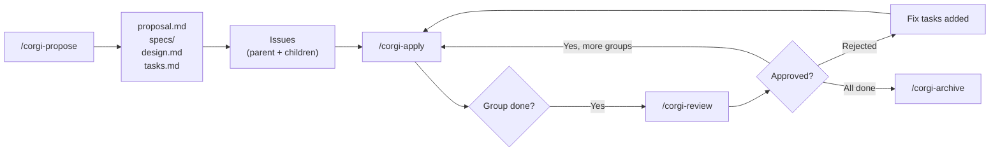
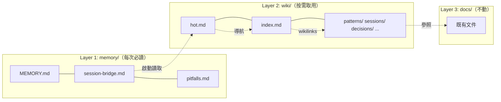

[English](README.md) | **繁體中文**

# OpenSpec GitFlow

把 AI coding assistants 轉成結構化的工程工作流程，結合 schema-driven planning、checkpoint-based implementation，以及在 GitLab 或 GitHub 上的完整 issue tracking。

## 這是什麼

這個專案是 [OpenSpec](https://github.com/Fission-AI/OpenSpec) 的 **社群擴充版**，[OpenSpec](https://github.com/Fission-AI/OpenSpec) 是由 [Fission AI](https://github.com/Fission-AI) 開發的開源 CLI，用來在 AI-assisted development workflows 中管理 change artifacts（proposals、specs、designs、tasks）。

OpenSpec 提供核心 CLI（`openspec init`、artifact pipeline、change lifecycle）。**我們在它之上打造了 custom schemas 與 skills**，加入以下能力：

- **Issue tracking**，會在 GitLab (`glab`) 或 GitHub (`gh`) 自動建立 parent/child issues
- **Checkpoint-based apply：** 一次只執行一個 Task Group，完成 closeout 狀態同步後暫停等待 review
- **Interactive review cycle：** 先蒐集 review 證據，再要求明確決策，然後套用使用者同意的狀態轉換
- **Progress sync**，會把包含 objectives、completion、produced files 的詳細摘要發佈到 issues
- **Workflow labels**，狀態機為 `backlog → todo → in-progress → review → done`
- **Git worktree isolation**，可平行執行多個 changes，每個 change 都在自己的 worktree 中（opt-in）
- **Project-local installer**，installer v1 支援 OpenCode 與 Claude Code
- **可組合的 Skill 階層**，Skills 以 Atoms → Molecules → Compounds 三層架構組織，附帶機器可讀的 metadata，由 `ds-skills` CLI 驗證



這張圖只呈現 commands 之間的 handoff points。實際上，`/corgi-propose` 會在 planning artifacts 完成後 close out 成可追蹤的 handoff state，`/corgi-apply` 會把單一 Task Group 做到 implementation 與 closeout 完成後再停止，`/corgi-review` 則會先蒐集證據，再要求明確決策，最後套用使用者同意的狀態轉換。

## 快速開始

### 先決條件

- **Node.js 18+**（供 `corgispec` 使用）
- **OpenCode** 或 **Claude Code**
- **glab CLI** ([install](https://gitlab.com/gitlab-org/cli))，`gitlab-tracked` 必要
- **gh CLI** ([install](https://cli.github.com/))，`github-tracked` 必要
- 要使用 issue-tracking 功能，至少需要 `glab` 或 `gh` 其中之一。

### 1. 建置 `corgispec`

```bash
git clone https://github.com/ricoyudog/openspec_gitflow_modified.git
cd openspec_gitflow_modified/packages/corgispec
npm install
npm run build
```

### 2. 安裝到你的專案

複製並貼上以下提示詞到你的 LLM Agent（OpenCode、Claude Code、Cursor 等）：

```text
Fetch and follow instructions from https://raw.githubusercontent.com/ricoyudog/openspec_gitflow_modified/main/.opencode/INSTALL.md
```

如果你使用的不是 `main`，而是其他 branch 或 tag，請把 URL 中的 `main` 換成相同的 checked-out ref，確保抓到的 dispatcher 與本地 repo 內容一致。

這個 dispatcher 會指示 agent 執行 `corgispec bootstrap --target /path/to/project --mode auto`；如果你已經先提供 schema，則會附帶 `--schema <schema>`。

### 3. 查看 bootstrap 報告

Bootstrap 會在目標專案寫入 `openspec/.corgi-install-report.md`，agent 應該要摘要說明這次是 succeeded、stopped，還是 failed。

### 4. 在目標專案中開始使用這套工作流程

bootstrap 完成後，請在 OpenCode 或 Claude Code 中開啟 **目標專案**，然後開始使用這套 workflow：

```text
# OpenCode
/corgi-propose Add user authentication with JWT and refresh tokens

# Claude Code
/corgi:propose Add user authentication with JWT and refresh tokens
```

這會先產生所有 planning artifacts，接著寫入本地的 tracked handoff state，並把它鏡像到 parent/child issues。之後，`/corgi-apply` 會執行一個 Task Group 與其 closeout，然後停下來等 `/corgi-review`；而 `/corgi-review` 會先蒐集證據，再要求明確決策，最後套用使用者同意的狀態轉換。接著請使用對應 assistant 的 command 形式：

- OpenCode：`/corgi-apply`、`/corgi-review`、`/corgi-archive`、`/corgi-explore`
- Claude Code：`/corgi:apply`、`/corgi:review`、`/corgi:archive`、`/corgi:explore`

> **Platform detection**：所有 `/corgi-*` commands 都會從你的 `config.yaml` 自動偵測 GitLab 或 GitHub。相同的 commands，任一平台都能使用。

## 安裝 / 更新 / 驗證流程

若是新專案 onboarding，請優先使用上方的快速開始。以下內容保留作為較底層的 installer 參考，供明確 install、update、verify-only 與 legacy migration 情境使用。

### 舊版手動安裝流程

如果你需要改走較舊的明確安裝流程，而不是 bootstrap，請從這裡開始。

### 1. 在目標專案中初始化 OpenSpec

```bash
cd /path/to/your-project
openspec init
```

### 2. 從已複製的 repo 執行 installer

在 **OpenCode** 或 **Claude Code** 中開啟已 clone 的 `openspec_gitflow_modified` repo，然後執行 installer command。

範例：

```text
# OpenCode
/corgi-install --mode fresh --path /path/to/your-project

# Claude Code
/corgi:install --mode fresh --path /path/to/your-project
```

如果省略 flags，installer 會提示你輸入 target path、schema，以及是否啟用 worktree isolation。

installer 預設所需的使用者層級 skills 已經存在。若 bootstrap 沒有成功補齊它們，請先在已 clone 的 repo 中執行 `./install-skills.sh`，再回來重試這條手動路徑。

### 3. 回答 installer 的提示

- **Target project path**，也就是已經執行過 `openspec init` 的位置
- **Schema**，請選擇 `gitlab-tracked` 或 `github-tracked`
- **Worktree isolation**，只會在你明確選擇後啟用，絕不會自動開啟

installer 只會把 project-local 的 managed fileset 複製到目標專案：

- `.opencode/commands/corgi-*.md`
- `.claude/commands/corgi/*.md`
- `openspec/schemas/{selected-schema}/**`

接著只修改 `openspec/config.yaml` 中由 installer 管理的 keys，並把安裝狀態記錄在：

- `openspec/.corgi-install.json`
- `openspec/.corgi-install-report.md`
- `openspec/.corgi-backups/<timestamp>/`，當需要建立 legacy install backup 時使用

### 4. 查看驗證報告

每次 install、update，以及 verify-only 執行，都會在目標專案寫入 `openspec/.corgi-install-report.md`。

繼續之前請先查看。報告會記錄：

- prerequisite checks（`openspec`、`gh`、`glab`）
- 使用者層級 skill 檢查（`~/.claude/skills/corgispec-*`、`~/.config/opencode/skill/corgispec-*`）
- schema 與 `openspec/config.yaml` 檢查
- managed fileset sync 結果
- PASS/FAIL 狀態
- 是否有執行任何 mutations

### 5. 設定額外的專案 context（選填）

installer 只會管理 `openspec/config.yaml` 內的 `schema` 欄位與由 installer 擁有的 `isolation` keys。

之後你可以手動加入專案專屬的 `context` 與 `rules`：

```yaml
# REQUIRED: which schema to use
schema: gitlab-tracked   # or github-tracked

# RECOMMENDED: worktree isolation
# Each change gets its own git worktree + feature branch.
# propose/apply/review/archive all run inside the worktree.
# Without this, all changes share the same working directory.
isolation:
  mode: worktree           # worktree | none (default: none)
  root: .worktrees         # worktree root directory (default: .worktrees)
  branch_prefix: feat/     # feature branch prefix (default: feat/)

# OPTIONAL: project context for AI
# Guides artifact generation (proposal, specs, design).
context: |
  Tech stack: TypeScript, Next.js 14, Prisma, PostgreSQL
  We use conventional commits and Prettier
  Domain: e-commerce platform

# OPTIONAL: per-artifact rules
rules:
  proposal:
    - Keep proposals under 500 words
  tasks:
    - Max 2 hours per task
    - Each Task Group should be independently deployable
```

> **為什麼要啟用 worktree isolation？** 如果不啟用，所有 changes 都會共用你的主要 checkout，你一次只能處理一個 change，而且程式碼變更會和 main branch 混在一起。使用 worktrees 時，每個 change 都會在自己的目錄與自己的 feature branch 中隔離。執行 archive 時，worktree 會被清理，但 branch 會保留下來，方便你用 MR/PR 進行 merge。

installer 支援四種明確模式。

### 全新安裝

當目標專案還沒有 managed files，也還沒有 `openspec/.corgi-install.json` manifest 時，請使用這個模式。

- 需要使用者層級的 `corgispec-*` skills 已經存在於 `~/.claude/skills/` 與 `~/.config/opencode/skill/`
- 會把 managed fileset 複製到專案本地的 `.opencode/`、`.claude/` 與 `openspec/schemas/`
- 以最小幅度修改 `openspec/config.yaml`
- 詢問是否要啟用 worktree isolation
- 寫入 `openspec/.corgi-install.json` 與 `openspec/.corgi-install-report.md`

### 受管理更新

當目標專案已經有 `openspec/.corgi-install.json` 時，請使用這個模式。

```text
/corgi-install --mode update --path /path/to/your-project
```

installer 會先比對目前的 managed files 與 manifest hashes，再進行更新。

### 含本地修改的受管理更新

如果 installer 在 manifest 管理的檔案中發現 **local modifications**，它 **不會** 覆寫該檔案。

它會改成：

- 印出 diff
- 停止 update
- 把 FAIL 狀態寫入 `openspec/.corgi-install-report.md`
- 要求你先手動解決 local modifications，再重新嘗試

### 僅驗證

如果你想做 health check，而不對任何檔案做變更，請使用 verify-only：

```text
/corgi-install --mode verify --path /path/to/your-project
```

Verify-only 會檢查 prerequisites、使用者層級 skills 是否存在、managed fileset integrity、schema presence，以及 `openspec/config.yaml`，然後寫入 `openspec/.corgi-install-report.md`。

### Legacy install 遷移

如果 managed files 已經存在，但目標專案沒有 `openspec/.corgi-install.json` manifest，installer 會把專案判定為 **legacy install**。

這種情況下，它會：

- 清楚標示這是 legacy install
- 建立 `openspec/.corgi-backups/<timestamp>/`
- 在 migration 前要求你明確批准
- 如果你拒絕，就會中止，而且不會覆寫任何內容

若要查看涵蓋 fresh install、managed update、local modifications、verify-only、legacy install，以及 worktree prompting 的完整 agent-executable 驗證情境，請參考 `.sisyphus/plans/corgi-install-smoke-matrix.md`。

## 指令

| 指令 | 功能說明 |
|---------|-------------|
| OpenCode `/corgi-install` / Claude `/corgi:install` | 僅供 legacy/manual 情境使用的 installer 路徑，用來安裝、更新或驗證 project-local 資產 |
| OpenCode `/corgi-propose` / Claude `/corgi:propose` | 產生 planning artifacts，接著 close out 成可追蹤的 handoff state |
| OpenCode `/corgi-apply` / Claude `/corgi:apply` | 執行一個 Task Group，同步 closeout 狀態，然後停止等待 review |
| OpenCode `/corgi-review` / Claude `/corgi:review` | 蒐集證據、要求明確決策，然後套用使用者同意的狀態轉換 |
| OpenCode `/corgi-archive` / Claude `/corgi:archive` | 關閉所有 issues、同步 delta specs、萃取長期知識，並完成清理 |
| OpenCode `/corgi-explore` / Claude `/corgi:explore` | 思考夥伴，可用來探索想法、查看 issue feedback、釐清需求 |
| OpenCode `/corgi-memory-init` / Claude `/corgi:memory-init` | 初始化三層記憶結構（`memory/` + `wiki/`），啟用跨 session 延續性 |
| OpenCode `/corgi-migrate` / Claude `/corgi:migrate` | 匯入既有知識（docs、已歸檔 changes、vault 頁面）到 memory/wiki |
| OpenCode `/corgi-lint` / Claude `/corgi:lint` | 驗證記憶健康度 — 新鮮度、大小上限、broken links、萃取完整性 |
| OpenCode `/corgi-ask` / Claude `/corgi:ask` | 使用預算感知檢索回答來自 vault 的問題 |

## 設定

所有 project-level config 都放在 `openspec/config.yaml`。installer 只會更新 `schema` 欄位與由 installer 管理的 `isolation` keys。安裝完成後，可依需要加入 `context` 與 `rules`。

### Worktree 隔離（需手動啟用）

可平行執行多個 changes，每個 change 都使用自己的 git worktree：

```yaml
isolation:
  mode: worktree    # worktree | none (default: none)
  root: .worktrees  # default: .worktrees
  branch_prefix: feat/  # default: feat/
```

啟用後，OpenCode 的 `/corgi-propose` 或 Claude Code 的 `/corgi:propose` 會自動建立 worktree。後續所有 commands（`apply`、`review`、`archive`）都會在其中執行。執行 archive 時，worktree 會被清理，但 branch 會保留下來供你 merge。

## 跨 Session 記憶

AI sessions 預設是無狀態的。OpenSpec GitFlow 加入了 **三層記憶系統** — 啟動 ≤2900 tokens、自動壓縮、Obsidian 相容。



| 場景 | 指令 |
|------|------|
| 新專案 bootstrap | 將快速開始的提示詞貼入你的 agent — 它會執行 `corgispec bootstrap` |
| 既有專案加入記憶 | `/corgi-memory-init` |
| 遷移既有知識庫 | `/corgi-migrate` |
| 健康檢查 | `/corgi-lint` |

**[完整文件：架構、生命週期、遷移、Obsidian →](docs/cross-session-memory.zh-TW.md)**

## Schema

schema 會定義 artifact pipeline，要建立哪些文件、建立順序，以及 apply 階段要追蹤哪些內容。

### 內建 Schema

`gitlab-tracked` 與 `github-tracked` 兩者都會產生相同的 4-artifact pipeline：

| 產物 | 檔案 | 說明 |
|----------|------|-------------|
| 提案 | `proposal.md` | 動機、範圍、能力項目、影響 |
| 規格 | `specs/<capability>/spec.md` | 帶有 WHEN/THEN scenarios 的正式需求（每個 capability 各一份） |
| 設計 | `design.md` | 技術決策、架構、風險、取捨 |
| 任務 | `tasks.md` | 附 checkbox 的編號 Task Groups，每個 group 都會成為一個 child issue |

流程：`proposal → specs → design → tasks → apply`

關鍵設計決策：
- **Capabilities-driven specs**，proposal 會先定義 capabilities，之後每一項都會變成獨立的 spec file，形成可追蹤的契約。
- **Delta spec model**，specs 使用 ADDED/MODIFIED/REMOVED/RENAMED operations，讓變更能隨時間累積到 canonical specs 中。
- **Task Groups as checkpoint units**，`tasks.md` 中的每個 `## N. Group Name` 都等於一個 child issue、一個 apply session，以及一個 review cycle。

### 建立自訂 Schema

<details>
<summary>展開</summary>

在 `openspec/schemas/` 底下建立一個目錄：

```
openspec/schemas/my-schema/
├── schema.yaml
└── templates/
    ├── proposal.md
    └── tasks.md
```

定義 `schema.yaml`：

```yaml
name: my-schema
version: 1
description: Lightweight workflow with proposal and tasks

artifacts:
  - id: proposal
    generates: proposal.md
    description: What and why
    template: proposal.md
    instruction: |
      Write the proposal explaining the change motivation and scope.
    requires: []

  - id: tasks
    generates: tasks.md
    description: Implementation checklist
    template: tasks.md
    instruction: |
      Break implementation into numbered Task Groups with checkboxes.
    requires:
      - proposal

apply:
  requires:
    - tasks
  tracks: tasks.md
  instruction: |
    Execute one Task Group at a time. Mark tasks as [x] when done.
```

接著在 `config.yaml` 裡設定 `schema: my-schema`。

- `artifacts[].requires`，用來定義相依順序
- `artifacts[].template`，對應到 `templates/` 底下的檔案
- `artifacts[].instruction`，告訴 AI 要如何填入模板
- `apply.tracks`，指出哪個檔案包含 task checkboxes

</details>

## 它如何擴充原生 OpenSpec

| 能力 | 原生 OpenSpec | 本專案 |
|---|---|---|
| Issue tracking | 無 | 透過 `glab` 或 `gh` CLI 建立 parent/child issues |
| Apply 執行方式 | 一次執行全部 tasks | Checkpoint-based，一次只處理一個 group，並暫停等待 review |
| 進度同步 | 只有本地 checkboxes | 會把詳細摘要發佈到 issues |
| Workflow labels | 無 | 狀態機：`backlog → todo → in-progress → review → done` |
| Review | 無 | Automated quality checks，加上 approve/reject/discuss 與 repair loop |
| Spec 格式 | 通用 | 使用帶有正式 scenarios 的 delta operations（ADDED/MODIFIED/REMOVED/RENAMED） |
| Worktree isolation | 無 | 透過 git worktrees 進行可選的平行開發 |
| 跨 session 記憶 | 無 | 三層記憶系統，≤3000 token 啟動，自動壓縮，Obsidian 相容 |
| 知識遷移 | 無 | 從 docs、已歸檔 changes、agent configs、vault 頁面導入知識 |
| 記憶健康度 | 無 | 11 項 lint 檢查（新鮮度、大小上限、broken links、萃取完整性） |
| Skill 架構 | 扁平檔案 | 可組合三層階層（Atoms → Molecules → Compounds），含相依圖譜、schema 驗證與 CLI 工具鏈 |

## 儲存庫結構

```
schemas/
└── skill-meta.schema.json          # skill.meta.json 驗證用 JSON Schema

tools/ds-skills/                    # Skill 驗證與相依圖譜 CLI
├── package.json
├── bin/ds-skills.js                # CLI 進入點
├── lib/
│   ├── loader.js                   # 探索與解析 skill 目錄
│   ├── validate.js                 # Schema + 限制條件驗證
│   ├── list.js                     # 列出 skills（可篩選）
│   └── graph.js                    # 相依圖譜（mermaid/dot）
└── tests/

docs/
└── superpowers/
    ├── articles/                       # 已發佈的文章與 publish kits
    ├── plans/                          # 設計與規劃文件
    └── specs/                          # 功能設計規格

openspec/
├── config.yaml                     # 專案層級設定
├── schemas/
│   ├── gitlab-tracked/             # GitLab-integrated schema
│   │   ├── schema.yaml
│   │   └── templates/
│   └── github-tracked/             # GitHub-integrated schema
│       ├── schema.yaml
│       └── templates/
├── specs/                          # 累積的 specs（從 archived changes 同步）
└── changes/                        # 進行中的 change 目錄

.opencode/
├── skills/corgispec-*/              # Source-of-truth skill 定義
│   ├── SKILL.md                    # AI 可讀的指令
│   └── skill.meta.json             # 機器可讀的 metadata（tier、deps、platform）
└── commands/corgi-*.md              # Slash command dispatch

.claude/
├── skills/corgispec-*/              # Claude skill 鏡像
│   ├── SKILL.md
│   └── skill.meta.json
└── commands/corgi/                  # Claude slash command dispatch

.codex/
└── skills/corgispec-*/              # Codex skill 鏡像
    ├── SKILL.md
    └── skill.meta.json
```

## Skill 架構

Skills 採用 **可組合的三層階層**，靈感來自 [Skill Graphs 2.0](https://x.com/shivsakhuja/status/2047124337191444844)：

| 層級 | 說明 | 相依 |
|------|------|------|
| **Atom** | 單一可複用操作（例如：resolve config、parse tasks） | 無 |
| **Molecule** | 組合多個 atoms 的工作流程（例如：propose、apply、review） | 只能依賴 atoms |
| **Compound** | 組合 molecules 的端到端編排 | 只能依賴 molecules |

每個 skill 有兩個檔案：

- `SKILL.md` — AI 可讀的逐步指令（agent 讀的）
- `skill.meta.json` — 機器可讀的 metadata：tier、相依、platform、版本（CLI 讀的）

### ds-skills CLI

`ds-skills` CLI 用於驗證 skill 結構與視覺化相依關係：

```bash
cd tools/ds-skills && npm install

# 驗證所有 skills（schema + tier 限制 + 循環偵測）
node bin/ds-skills.js validate --path ../..

# 列出 skills（可選篩選條件）
node bin/ds-skills.js list --path ../..
node bin/ds-skills.js list --path ../.. --tier atom --platform github

# 產生相依圖譜
node bin/ds-skills.js graph --path ../..              # Mermaid 格式
node bin/ds-skills.js graph --path ../.. --format dot  # Graphviz 格式

# 顯示特定 skill 的相依樹
node bin/ds-skills.js check-deps --path ../.. corgi-propose
```

## 文件

| 文章 | 語言 | 說明 |
|------|------|------|
| [OpenSpec 落地 GitHub](docs/superpowers/articles/2026-04-28-corgispec-github-workflow-zhihu.md) | 中文 | 我們如何把 Spec、Issue、Review 和 Git 工作流接成一條線——知乎專欄文章 |

## 如何貢獻

1. Fork 並 clone 這個 repo
2. 在 `.opencode/skills/` 下建立或更新 skill folder
3. 每個 skill 需要：
   - `SKILL.md`，帶 YAML frontmatter（`name`、`description`）— AI 指令
   - `skill.meta.json`，符合 `schemas/skill-meta.schema.json` — CLI 用的 metadata
4. 執行 `node tools/ds-skills/bin/ds-skills.js validate --path .` 檢查你的變更
5. 送出 PR 前先在本機測試
6. Supporting files 請放在 `references/`、`agents/` 或 `templates/` 子目錄

## 致謝

這個專案建立在 [Fission AI](https://github.com/Fission-AI) 的 [OpenSpec](https://github.com/Fission-AI/OpenSpec) 之上。核心 CLI、artifact pipeline engine，以及 change lifecycle management 都由 OpenSpec 提供，我們則在其上擴充了 custom schemas、AI skills 與 issue-tracking integrations。

如果你覺得這個專案有幫助，也請順手幫 [原始 OpenSpec repo](https://github.com/Fission-AI/OpenSpec) 點個 star。
