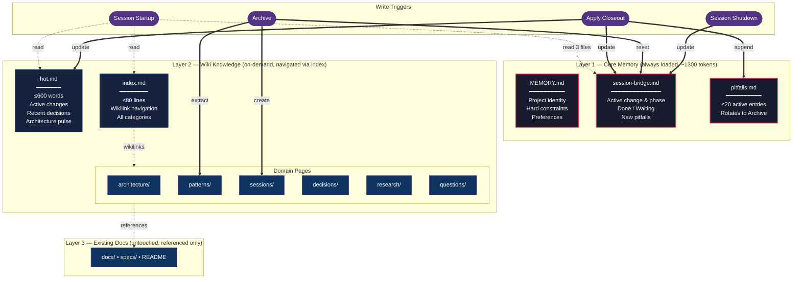
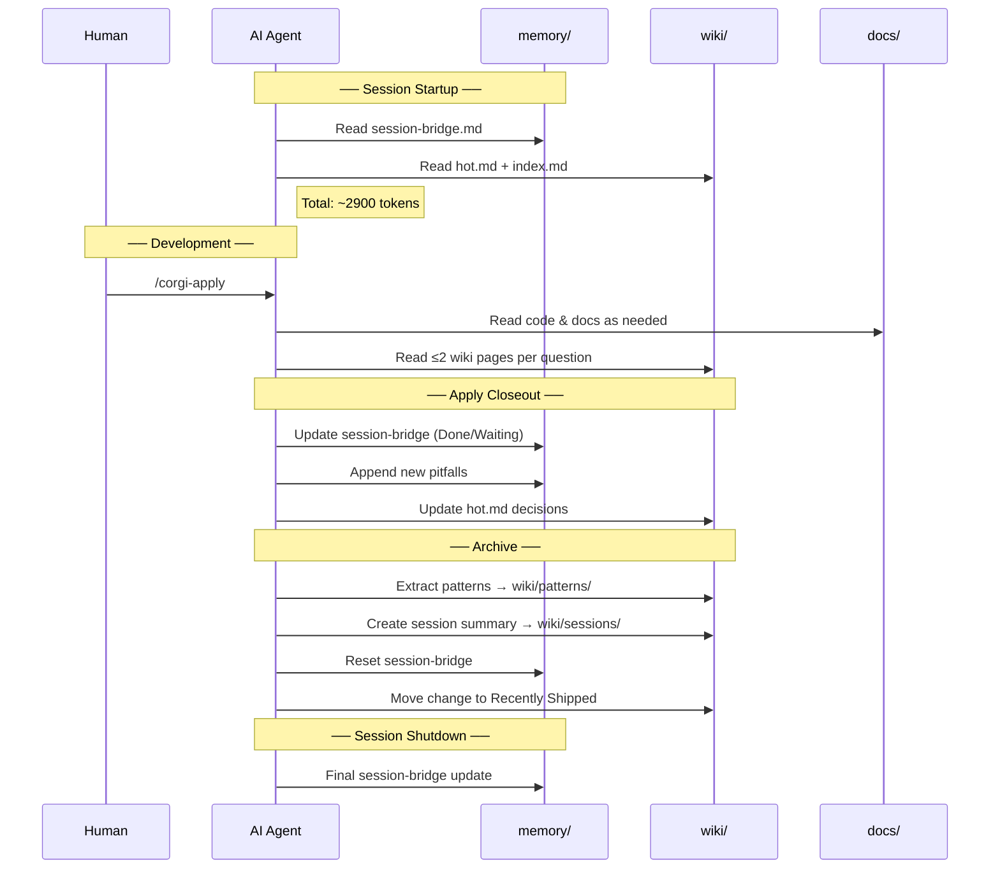

**English** | [繁體中文](cross-session-memory.zh-TW.md)

# Cross-Session Memory

AI coding sessions are stateless by default — every new session starts from scratch. OpenSpec GitFlow adds a **3-layer memory system** that gives AI agents cross-session continuity while staying under a strict token budget (~2900 tokens at startup).

## The Problem

Without memory, each session wastes tokens re-discovering:
- What was decided in prior sessions
- What pitfalls were already hit (and hit again)
- What the project's implicit rules and contracts are
- Where the last session left off

## Architecture



## Lifecycle Integration



## File Structure

```
Layer 1: memory/          ← Always loaded at startup (~1300 tokens)
├── MEMORY.md             Hard constraints, project identity (write-once)
├── session-bridge.md     Last session's handoff state (write-every-session)
└── pitfalls.md           Cross-change pitfall log (append + rotate)

Layer 2: wiki/            ← On-demand, navigated via index (~700 tokens for index)
├── hot.md                Project pulse, recent decisions (write-every-session)
├── index.md              Navigation hub with wikilinks (80-line cap)
├── architecture/         Structural insights, implicit contracts
├── patterns/             Reusable approaches from completed changes
├── sessions/             Historical summaries of archived changes
├── decisions/            Key decisions from reviews
├── research/             Investigation results from explore sessions
└── questions/            Human Q&A via Obsidian

Layer 3: docs/            ← Existing project documentation (untouched)
```

## Key Design Decisions

| Decision | Rationale |
|----------|-----------|
| Word/line caps instead of token counting | Skills have no runtime — AI self-enforces during writes |
| Separate `memory/` from `wiki/` | Core memory (always loaded) vs archival (on-demand) — from MemGPT research |
| Compaction as agent self-maintenance | No cron/daemon available — agent compacts during normal writes |
| Lint as standalone, not gate | Never blocks workflow; periodic health check via `/corgi-lint` |
| Early-stop retrieval for ask | Budget-aware: max 2 wiki pages per question, stop when sufficient |

## File Size Limits

Memory self-compacts via hard caps. The AI agent enforces these during writes; `/corgi-lint` validates post-hoc:

| File | Target | Hard Cap | Overflow Action |
|------|--------|----------|-----------------|
| `wiki/hot.md` | 500 words | 600 words | Trim oldest entries |
| `wiki/index.md` | 40 lines | 80 lines | Archive completed entries |
| `memory/pitfalls.md` | 10 active | 20 active | Rotate oldest 10 to Archive |
| `memory/session-bridge.md` | 30 lines | 50 lines | Archive old Done items |

## Getting Started

### New Project

Memory initializes automatically during `/corgi-install` (opt-out with `--no-memory`):

```text
/corgi-install --path /path/to/project
# Installer asks: "Initialize memory structure? (yes/no — default: yes)"
```

### Existing Project (no prior knowledge)

Add memory to a project that already uses OpenSpec:

```text
/corgi-memory-init
```

### Existing Project with Accumulated Knowledge

Migrate docs, archived changes, and vault pages into the memory structure:

```text
/corgi-migrate
```

The migrate skill runs 4 phases:

1. **Agent Config Deepening** (auto) — extracts constraints from CLAUDE.md/AGENTS.md into `memory/MEMORY.md`
2. **Archived Changes** (auto) — generates session summaries and patterns from `openspec/changes/archive/`
3. **docs/ Directory** (hybrid) — auto-categorizes obvious docs, asks about ambiguous ones
4. **Vault Pages** (hybrid) — presents found .md files for user categorization

Migration never moves or deletes source files — it creates wiki entries that reference originals.

## Obsidian Compatibility

All memory files are valid markdown with `[[wikilinks]]`. If your project is also an Obsidian vault:
- `wiki/` renders as a navigable knowledge graph
- `memory/` shows session state at a glance
- Humans can browse, search, and even edit memory files directly
- `/corgi-ask` answers questions created as pending .md files in the vault

## Related Commands

| Command | Purpose |
|---------|---------|
| `/corgi-memory-init` | Initialize the 3-layer memory structure |
| `/corgi-migrate` | Import existing knowledge into memory/wiki |
| `/corgi-lint` | Validate memory health (11 checks) |
| `/corgi-ask` | Answer questions using budget-aware retrieval |

## Further Reading

- [Design document](../openspec/changes/corgispec-llm-memory/design.md) — architecture decisions, risks, trade-offs
- [Proposal](../openspec/changes/corgispec-llm-memory/proposal.md) — motivation and scope
- Research references: MemGPT, GenericAgent, xMemory
