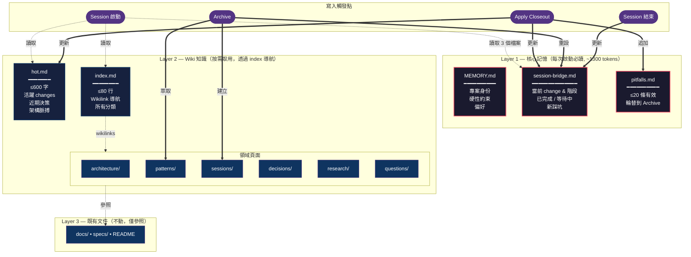
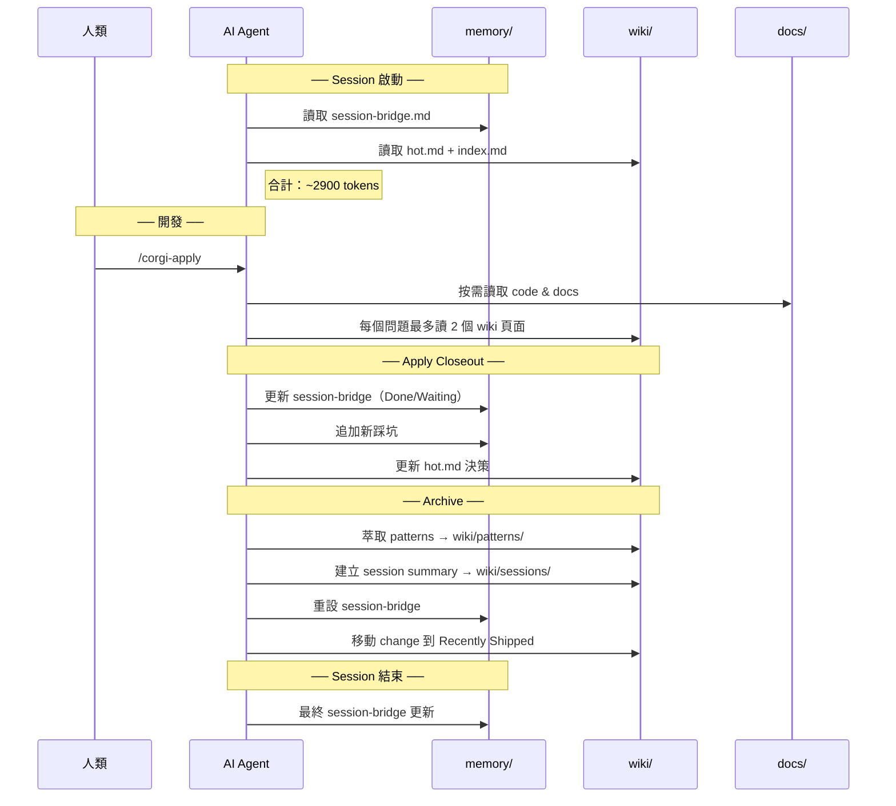

[English](cross-session-memory.md) | **繁體中文**

# 跨 Session 記憶

AI coding sessions 預設是無狀態的 — 每個新 session 都從零開始。OpenSpec GitFlow 加入了 **三層記憶系統**，讓 AI agent 跨 session 保持延續性，同時控制在嚴格的 token 預算內（啟動 ~2900 tokens）。

## 問題

沒有記憶的情況下，每次 session 都在浪費 tokens 重新發現：
- 之前 session 做過什麼決策
- 之前踩過哪些坑（然後再踩一次）
- 專案有哪些隱性規則與契約
- 上一個 session 進行到哪裡

## 架構



## 生命週期整合



## 檔案結構

```
Layer 1: memory/          ← 每次啟動必讀（~1300 tokens）
├── MEMORY.md             硬性約束、專案身份（寫入一次）
├── session-bridge.md     上一個 session 的 handoff 狀態（每次 session 更新）
└── pitfalls.md           跨 change 的踩坑紀錄（追加 + 輪替）

Layer 2: wiki/            ← 按需取用，透過 index 導航（index ~700 tokens）
├── hot.md                專案脈搏，近期決策（每次 session 更新）
├── index.md              知識導航中樞，wikilinks（80 行上限）
├── architecture/         結構性洞察、隱性契約
├── patterns/             從已完成 changes 萃取的可重用模式
├── sessions/             已歸檔 changes 的歷史摘要
├── decisions/            review 階段的重要決策
├── research/             explore session 的調查結果
└── questions/            人類透過 Obsidian 提問，AI 回答

Layer 3: docs/            ← 既有專案文件（不動）
```

## 關鍵設計決策

| 決策 | 理由 |
|------|------|
| 用字數/行數上限取代 token 計數 | Skills 沒有 runtime — AI 在寫入時自行維護 |
| 分離 `memory/` 與 `wiki/` | 核心記憶（必定載入）vs 歸檔知識（按需取用）— 源自 MemGPT 研究 |
| 壓縮作為 agent 自我維護 | 沒有 cron/daemon 可用 — agent 在正常寫入時自行壓縮 |
| Lint 是獨立工具，不是閘門 | 永遠不會阻擋工作流；透過 `/corgi-lint` 定期健康檢查 |
| Ask 使用 early-stop 檢索 | 預算感知：每個問題最多 2 個 wiki 頁面，找到足夠資訊即停止 |

## 檔案大小上限

記憶透過硬性上限自動壓縮。AI agent 在寫入時自行維護這些上限；`/corgi-lint` 事後驗證：

| 檔案 | 目標 | 硬性上限 | 超限動作 |
|------|------|----------|----------|
| `wiki/hot.md` | 500 字 | 600 字 | 刪除最舊的 entries |
| `wiki/index.md` | 40 行 | 80 行 | 歸檔已完成的 entries |
| `memory/pitfalls.md` | 10 條有效 | 20 條有效 | 最舊 10 條輪替到 Archive |
| `memory/session-bridge.md` | 30 行 | 50 行 | 歸檔舊的 Done 項目 |

## 如何開始使用

### 新專案

在 `/corgi-install` 過程中自動初始化記憶（用 `--no-memory` 可跳過）：

```text
/corgi-install --path /path/to/project
# Installer 會問："Initialize memory structure? (yes/no — default: yes)"
```

### 既有專案（無先前知識）

為已使用 OpenSpec 的專案加入記憶：

```text
/corgi-memory-init
```

### 既有專案且有累積知識

把 docs、已歸檔 changes 和 vault 頁面遷移進記憶結構：

```text
/corgi-migrate
```

Migrate skill 分 4 個階段執行：

1. **Agent Config 深化**（自動）— 從 CLAUDE.md/AGENTS.md 萃取約束到 `memory/MEMORY.md`
2. **已歸檔 Changes**（自動）— 從 `openspec/changes/archive/` 產生 session summaries 與 patterns
3. **docs/ 目錄**（混合）— 自動分類明確的文件，對模糊的詢問使用者
4. **Vault 頁面**（混合）— 呈現找到的 .md 檔案讓使用者分類

遷移永遠不會移動或刪除來源檔案 — 只會建立 wiki entries 來參照原始文件。

## Obsidian 相容性

所有記憶檔案都是合法的 markdown + `[[wikilinks]]`。如果你的專案也是 Obsidian vault：
- `wiki/` 會渲染成可導航的知識圖譜
- `memory/` 可一覽 session 狀態
- 人類可以直接瀏覽、搜尋、甚至編輯記憶檔案
- `/corgi-ask` 可回答在 vault 中建立的 pending .md 問題檔

## 相關指令

| 指令 | 用途 |
|------|------|
| `/corgi-memory-init` | 初始化三層記憶結構 |
| `/corgi-migrate` | 匯入既有知識到 memory/wiki |
| `/corgi-lint` | 驗證記憶健康度（11 項檢查） |
| `/corgi-ask` | 使用預算感知檢索回答問題 |

## 延伸閱讀

- [設計文件](../openspec/changes/corgispec-llm-memory/design.md) — 架構決策、風險、權衡
- [提案](../openspec/changes/corgispec-llm-memory/proposal.md) — 動機與範圍
- 研究參考：MemGPT、GenericAgent、xMemory
