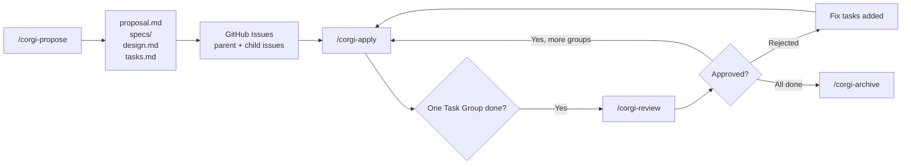
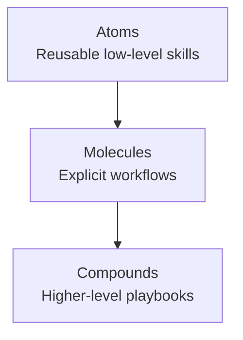

# OpenSpec 落地 GitHub：我们如何把 Spec、Issue、Review 和 Git 工作流接成一条线

> 当 spec 能持续流入 issue、apply、review 与 archive，AI workflow 才真正开始像工程流程。

**摘要：** 很多团队已经能用 AI 生成 proposal、spec、design 和 tasks，真正的难点却是这些产物常常停在本地，进不了 GitHub 的 issue、review 与执行节奏。本文介绍我们如何以 OpenSpec 为底座，补齐 GitHub / Git 工作流，并用可复用 skills 减少重复劳动。

很多团队在做 AI 辅助开发时，已经能生成 `proposal.md`、`specs/`、`design.md` 和 `tasks.md`。真正难的，往往不是把这些文档写出来，而是把它们真正接到 GitHub 的 issue、review、执行节奏和 Git 隔离里。

如果这一步没有打通，OpenSpec 更像一个很强的规划工具，而不是一个能稳定落地的工程工作流。我们这次做的事情，不是替代 OpenSpec，而是在它之上补齐一层更适合 GitHub 和日常 Git 开发的工作流能力。

## 不是不会写 spec，而是很难把 spec 变成 GitHub 流程

问题通常不在于团队不会写 spec，而在于 spec 写完之后，后面靠什么继续推进。很多团队的现实情况是：文档在仓库里，执行在聊天里，进度在 issue 里，review 又回到另一套习惯动作里。这样一来，spec 虽然存在，但很难成为 GitHub 流程里真正持续生效的一部分。

所以我们关心的不是“再把 spec 写漂亮一点”，而是怎么让它继续往下走：进入 GitHub Issues、通过 labels 和 `gh` CLI 保持跟踪，再在 apply、review 和 archive 这些明确节点里继续发挥作用。

## OpenSpec 已经做对了什么

OpenSpec 解决的是 AI 辅助开发里最基础、也最容易失控的一层：change artifacts，也就是 proposal、spec、design、tasks 这一组变更产物。它把这些东西组织成一个清晰的 change lifecycle，让团队不是“想到什么写什么”，而是围绕一个明确变更来生成、讨论和推进。

这一点非常重要，因为没有 artifact pipeline，后面的执行、review 和协作几乎都会变成即兴发挥。也正因为 OpenSpec 已经把这层底座搭好了，我们才有空间继续往上补：让这些 artifacts 真正进入 GitHub 和 Git 的日常工作流。

## 我们在 OpenSpec 之上补了什么

我们没有去改写 OpenSpec 的核心思路，而是在它之上补了一层更适合 GitHub 用户的 workflow glue。对普通开发者来说，最关键的不是“再多一个能生成文档的工具”，而是这些文档能不能继续流进 issue 跟踪、分组执行、review 节点和 Git 隔离。

| OpenSpec 底座 | 我们补上的能力 | 这对 GitHub 用户意味着什么 |
|---|---|---|
| 变更文档产物 | `github-tracked` schema，把 change 映射到 GitHub issue 跟踪 | 文档不再停留在本地，而是连到活的 issue 流程 |
| 规划产物 | checkpoint-based apply，一次只推进一个 Task Group（任务分组） | 执行范围更小，review 成本更可控 |
| 模糊的 review 交接 | interactive review cycle，先收集证据再做明确决策 | review 不再只是口头确认 |
| 本地进度 | rich issue summaries，把目标、产物和状态同步回 issue | 协作信息不再散落在聊天和本地文档里 |
| 共用 checkout | git worktree isolation，每个 change 使用独立工作区 | 多个 changes 可以并行推进，互不污染 |
| 容易重复拼装的 skills | 可组合 skill hierarchy，把能力拆成可复用层级 | 减少重复劳动，也减少 GitHub / GitLab 两边的实现漂移 |

如果你习惯用 GitHub Project，也可以把它当成一个可视化管理视图。但在当前实现里，真正的跟踪核心仍然是本地 artifacts、GitHub Issues、labels 和 `gh` CLI，而不是 Project 本身。

## 为什么“可复用 Skill”能减少重复劳动

说得更直接一点，这个分层设计不是为了起一个更好听的名字，而是为了避免每次扩一个流程都从头拼一次。

很多 AI workflow 的问题，不是能力不够，而是工作流一复杂，就开始反复重复同样的拼装动作。每增加一个复合流程，就要重新写一遍步骤、重新接一遍平台逻辑、重新处理一遍边界条件。最后的结果通常不是“更灵活”，而是重复劳动越来越多，GitHub 和 GitLab 两边的实现也越来越容易漂移。

我们想解决的正是这一点：不要让每个复合工作流都从头写起，而是把真正稳定、可复用的能力抽成更小的单元。于是这里引入了一个更容易扩展的结构：Atoms、Molecules、Compounds。

- Atoms：单一用途、边界清晰、接近确定性的原子能力
- Molecules：把 2 到 10 个原子能力组合成一个显式工作流
- Compounds：把多个分子流程编排成更高层的 playbook

这件事对普通开发者的意义并不抽象。它意味着你以后不是每加一个流程就重写一遍，而是可以复用已有能力，保持流程一致性，并且更容易做验证和维护。

## 一个 GitHub 用户能直接理解的例子

举一个最直接的例子：假设你要给项目加上 `JWT + refresh token` 登录能力。

这时候你可以先从 `/corgi-propose` 开始；这里的 `/corgi-*` 指的是这个仓库里用于驱动工作流的命令 / skill 入口，让系统生成 proposal、spec、design 和 tasks。到这一步，事情还只是“规划完成”。真正关键的是，后续流程不会停在本地 markdown 文件里，而是会继续进入 GitHub 跟踪。

接下来，workflow 会把 change 映射到 GitHub Issues。然后你可以用 `/corgi-apply` 一次执行一个 Task Group，而不是把整个变更一次性做完。这样每一轮推进的范围更小，review 成本也更可控。

当一个 Task Group 完成后，再进入 `/corgi-review`。这里的重点不是“自动往下走”，而是先收集证据，再要求一个明确的人类决策：批准、拒绝，或者回到修复。也就是说，review 在这套流程里不是一句口头确认，而是真正的审核关口。

如果批准，就继续推进下一个 Task Group；等所有组都完成后，再进入 `/corgi-archive` 做最终归档。这整个路径的价值在于：spec 没有停在 planning 阶段，而是真的沿着 GitHub 的执行节奏走到了结束。

如果你打算发知乎，下面两张 Mermaid 图更适合作为草稿 / 源图，正式发布时建议转成图片，或者按平台样式重绘。

回到前面的 `JWT + refresh token` 例子，这种分层的意义就在于：具体 change 可以复用同一套能力组合，而不必每次都重新拼一遍流程。

## 这套流程对 GitHub 用户到底有什么帮助

把这些东西放在一起看，这套流程给 GitHub 用户带来的好处很具体：

1. planning artifacts 不再是脱离执行的文档，它们会继续流进 issue 跟踪和 review 节奏里。
2. review 不再是一个模糊的“差不多可以了”，而是一个有证据、有决策的明确节点。
3. 如果你同时推进多个 change，worktree isolation 可以让它们保持隔离，不必把所有试验都堆在同一个 checkout 里。
4. 当 skills 可以被复用时，流程就不会越来越像手工拼装，而会越来越像可维护的系统。

## 结语：先从一个 change 开始

如果你已经在用 OpenSpec，最值得尝试的，不一定是立刻把整套流程一次性铺满，而是先挑一个 feature-sized change 跑通：从 propose 开始，到 apply、review，最后 archive。只要这条链路真的跑通一次，你就会很快感受到差别：OpenSpec 不再只是“帮你写文档”，而是开始进入你真正的 GitHub 工程流程。

对我们来说，这也是这次扩展最核心的目标：不是把 OpenSpec 换掉，而是让它更适合真实团队、更适合 GitHub 用户，也更适合那些想把 AI workflow 从 demo 拉到工程实践的人。
