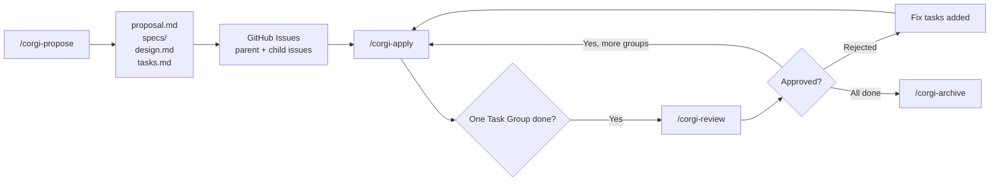
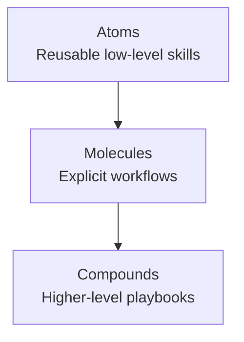

# OpenSpec GitHub Zhihu Article Implementation Plan

> **For agentic workers:** REQUIRED SUB-SKILL: Use superpowers:subagent-driven-development (recommended) or superpowers:executing-plans to implement this plan task-by-task. Steps use checkbox (`- [ ]`) syntax for tracking.

**Goal:** Draft a publishable Zhihu article in Simplified Chinese that presents this repo as a GitHub-friendly extension of OpenSpec, with accurate claims, a practical GitHub example, and a clear reusable-skill narrative.

**Architecture:** The article will live in one markdown file under `docs/superpowers/articles/`. It will open from a concrete GitHub workflow pain point, frame OpenSpec respectfully as the base layer, then focus on the repo's GitHub-oriented additions, reusable skill hierarchy, one staged example, and a practical close. Verification is editorial rather than unit-test based: each operational claim must trace back to the approved design spec, README content, or existing workflow docs, and banned overclaims must be absent.

**Tech Stack:** Markdown, Mermaid, README.md, README.zh-TW.md, approved design spec, GitHub / OpenSpec workflow terminology.

**Design Spec:** `docs/superpowers/specs/2026-04-28-corgispec-github-zhihu-article-design.md`

---

## File Structure

```
docs/superpowers/articles/
└── 2026-04-28-corgispec-github-workflow-zhihu.md
   # Final Zhihu article draft in Simplified Chinese

docs/superpowers/specs/
└── 2026-04-28-corgispec-github-zhihu-article-design.md
   # Approved article design

README.md
README.zh-TW.md
docs/superpowers/specs/2026-04-27-composable-skill-hierarchy-design.md
   # Source material for verified claims and the repeated-work framing
```

## Acceptance Criteria

- The article is written in Simplified Chinese and uses the recommended title or a close variant.
- The article explains what OpenSpec already does, what this repo adds, and why GitHub users benefit.
- The article includes one concrete `propose -> apply -> review -> archive` example.
- The article includes the workflow diagram and the Atoms -> Molecules -> Compounds diagram as Mermaid blocks.
- The article explicitly presents human review as a real gate.
- The article does not present GitHub Project as the current system of record.
- The article includes the repeated-work argument: composite workflows should not be rewritten from scratch.

---

### Task 1: Create the article scaffold and opening angle

**Files:**
- Create: `docs/superpowers/articles/2026-04-28-corgispec-github-workflow-zhihu.md`
- Reference: `docs/superpowers/specs/2026-04-28-corgispec-github-zhihu-article-design.md`
- Reference: `README.md`
- Reference: `README.zh-TW.md`

- [ ] **Step 1: Verify the parent docs directory exists**

Run: `ls docs/superpowers`
Expected: `plans` and `specs` are listed.

- [ ] **Step 2: Create the article directory**

Run: `mkdir -p docs/superpowers/articles`
Expected: `docs/superpowers/articles/` exists.

- [ ] **Step 3: Write the article title, opening hook, and section skeleton**

Write this exact markdown into `docs/superpowers/articles/2026-04-28-corgispec-github-workflow-zhihu.md`:

```markdown
<!-- 备选标题：
1. OpenSpec 不只是写 Spec：我们把它补成了一个 GitHub 友好的工程工作流
2. 从 Proposal 到 Review：普通开发者也能用的 OpenSpec 工作流
3. 为什么我们要在 OpenSpec 之上补一层 GitHub 工作流
-->

# 如何把 OpenSpec 真正用进 GitHub 工作流

很多团队在做 AI 辅助开发时，已经能生成 `proposal.md`、`spec.md`、`design.md` 和 `tasks.md`。真正难的，往往不是把这些文档写出来，而是把它们真正接到 GitHub 的 issue、review、执行节奏和 Git 隔离里。

如果这一步没有打通，OpenSpec 更像一个很强的 planning tool，而不是一个能稳定落地的 engineering workflow。我们这次做的事情，不是替代 OpenSpec，而是在它之上补齐一层更适合 GitHub 和日常 Git 开发的工作流能力。

## 不是不会写 spec，而是很难把 spec 变成 GitHub 流程

## OpenSpec 已经做对了什么

## 我们在 OpenSpec 之上补了什么

## 为什么“可复用 Skill”能减少重复劳动

## 一个 GitHub 用户能直接理解的例子

## 这套流程对 GitHub 用户到底有什么帮助

## 结语：先从一个 change 开始
```

- [ ] **Step 4: Verify the scaffold structure**

Run: `rg '^# |^## ' docs/superpowers/articles/2026-04-28-corgispec-github-workflow-zhihu.md`
Expected: one `#` title and six `##` section headings appear in the output.

- [ ] **Step 5: Commit the scaffold if the execution session has explicit commit approval**

```bash
git add docs/superpowers/articles/2026-04-28-corgispec-github-workflow-zhihu.md
git commit -m "docs: scaffold OpenSpec GitHub Zhihu article"
```

---

### Task 2: Write the upstream framing and the GitHub-facing value section

**Files:**
- Modify: `docs/superpowers/articles/2026-04-28-corgispec-github-workflow-zhihu.md`
- Reference: `README.md`
- Reference: `README.zh-TW.md`

- [ ] **Step 1: Fill in the upstream framing section with this exact content**

Under `## OpenSpec 已经做对了什么`, write:

```markdown
OpenSpec 解决的是 AI 辅助开发里最基础、也最容易失控的一层：change artifacts。它把 proposal、spec、design、tasks 这些东西组织成一个清晰的 change lifecycle，让团队不是“想到什么写什么”，而是围绕一个明确变更来生成、讨论和推进。

这一点非常重要，因为没有 artifact pipeline，后面的执行、review 和协作几乎都会变成即兴发挥。也正因为 OpenSpec 已经把这层底座搭好了，我们才有空间继续往上补：让这些 artifacts 真正进入 GitHub 和 Git 的日常工作流。
```

- [ ] **Step 2: Fill in the repo additions section with this exact comparison table and lead-in paragraph**

Under `## 我们在 OpenSpec 之上补了什么`, write:

```markdown
我们没有去改写 OpenSpec 的核心思路，而是在它之上补了一层更适合 GitHub 用户的 workflow glue。对普通开发者来说，最关键的不是“再多一个能生成文档的工具”，而是这些文档能不能继续流进 issue 跟踪、分组执行、review 节点和 Git 隔离。

| OpenSpec 底座 | 我们补上的能力 | 为什么 GitHub 用户会在意 |
|---|---|---|
| 变更文档产物 | `github-tracked` schema 和 GitHub issue 同步 | 文档不再停留在本地，而是连到活的 issue 跟踪 |
| 规划产物 | checkpoint-based apply | 一次只推进一个 Task Group，而不是一口气做完整个 change |
| 模糊的 review 交接 | interactive review cycle | 先收集证据，再要求明确批准或拒绝 |
| 本地进度 | rich issue summaries 和状态同步 | 团队成员在 GitHub 上就能看到进展 |
| 共用 checkout | git worktree isolation | 多个 changes 可以并行推进，不会互相污染分支 |
| 容易重复拼装的 skills | 可组合 skill hierarchy | 复用已有能力，减少重复劳动和平台漂移 |

如果你习惯用 GitHub Project，也可以把它当成一个可视化管理视图。但在当前实现里，真正的跟踪核心仍然是本地 artifacts、GitHub Issues、labels 和 `gh` CLI，而不是 Project 本身。
```

- [ ] **Step 3: Verify the operational claims against the README files**

Run: `rg 'gh CLI|github-tracked|Checkpoint-based apply|Interactive review cycle|Git worktree isolation|Composable skill hierarchy' README.md README.zh-TW.md`
Expected: matches for all six capability areas appear across the two README files.

- [ ] **Step 4: Verify the article uses precise GitHub wording**

Run: `rg 'GitHub Issues|gh CLI|GitHub Project' docs/superpowers/articles/2026-04-28-corgispec-github-workflow-zhihu.md`
Expected: `GitHub Issues` and `gh CLI` appear. `GitHub Project` appears at most once and only in the qualified sentence that describes it as a view, not the core tracked implementation.

- [ ] **Step 5: Commit the value section if the execution session has explicit commit approval**

```bash
git add docs/superpowers/articles/2026-04-28-corgispec-github-workflow-zhihu.md
git commit -m "docs: add GitHub workflow framing to Zhihu article"
```

---

### Task 3: Add the reusable-skill argument, practical example, and diagrams

**Files:**
- Modify: `docs/superpowers/articles/2026-04-28-corgispec-github-workflow-zhihu.md`
- Reference: `docs/superpowers/specs/2026-04-27-composable-skill-hierarchy-design.md`
- Reference: `README.md`

- [ ] **Step 1: Write the repeated-work section with this exact content**

Under `## 为什么“可复用 Skill”能减少重复劳动`, write:

```markdown
很多 AI workflow 的问题，不是能力不够，而是工作流一复杂，就开始反复重复同样的拼装动作。每增加一个复合流程，就要重新写一遍步骤、重新接一遍平台逻辑、重新处理一遍边界条件。最后的结果通常不是“更灵活”，而是重复劳动越来越多，GitHub 和 GitLab 两边的实现也越来越容易漂移。

我们想解决的正是这一点：不要让每个复合工作流都从头写起，而是把真正稳定、可复用的能力抽成更小的单元。于是这里引入了一个更容易扩展的结构：Atoms、Molecules、Compounds。

- Atoms：单一用途、边界清晰、接近确定性的原子能力
- Molecules：把 2 到 10 个原子能力组合成一个显式工作流
- Compounds：把多个分子流程编排成更高层的 playbook

这件事对普通开发者的意义并不抽象。它意味着你以后不是每加一个流程就重写一遍，而是可以复用已有能力，保持流程一致性，并且更容易做验证和维护。
```

- [ ] **Step 2: Write the practical GitHub example and workflow walkthrough**

Under `## 一个 GitHub 用户能直接理解的例子`, write:

```markdown
举一个最直接的例子：假设你要给项目加上 `JWT + refresh token` 登录能力。

这时候你可以先从 `/corgi-propose` 开始，让系统生成 proposal、spec、design 和 tasks。到这一步，事情还只是“规划完成”。真正关键的是，后续流程不会停在本地 markdown 文件里，而是会继续进入 GitHub 跟踪。

接下来，workflow 会把 change 映射到 GitHub Issues。然后你可以用 `/corgi-apply` 一次执行一个 Task Group，而不是把整个变更一次性做完。这样每一轮推进的范围更小，review 成本也更可控。

当一个 Task Group 完成后，再进入 `/corgi-review`。这里的重点不是“自动往下走”，而是先收集 evidence，再要求一个明确的人类决策：批准、拒绝，或者回到修复。也就是说，review 在这套流程里不是一句口头确认，而是真正的 gate。

如果批准，就继续推进下一个 Task Group；等所有组都完成后，再进入 `/corgi-archive` 做最终归档。这整个路径的价值在于：spec 没有停在 planning 阶段，而是真的沿着 GitHub 的执行节奏走到了结束。
```

- [ ] **Step 3: Insert the workflow and skill-hierarchy Mermaid diagrams**

Insert this block immediately after the GitHub example section:

```markdown



```

- [ ] **Step 4: Verify that both diagrams and workflow commands are present**

Run: `rg '^```mermaid|/corgi-propose|/corgi-apply|/corgi-review|/corgi-archive|Atoms|Molecules|Compounds' docs/superpowers/articles/2026-04-28-corgispec-github-workflow-zhihu.md`
Expected: two Mermaid code fences appear, all four `/corgi-*` commands appear, and `Atoms`, `Molecules`, `Compounds` appear.

- [ ] **Step 5: Commit the example and diagrams if the execution session has explicit commit approval**

```bash
git add docs/superpowers/articles/2026-04-28-corgispec-github-workflow-zhihu.md
git commit -m "docs: add workflow example and diagrams to Zhihu article"
```

---

### Task 4: Write the closing section and run editorial verification

**Files:**
- Modify: `docs/superpowers/articles/2026-04-28-corgispec-github-workflow-zhihu.md`
- Reference: `docs/superpowers/specs/2026-04-28-corgispec-github-zhihu-article-design.md`

- [ ] **Step 1: Write the benefit summary and close with this exact content**

Under `## 这套流程对 GitHub 用户到底有什么帮助`, write:

```markdown
把这些东西放在一起看，这套流程给 GitHub 用户带来的好处很具体。

第一，planning artifacts 不再是脱离执行的文档；它们会继续流进 issue 跟踪和 review 节奏里。第二，review 不再是一个模糊的“差不多可以了”，而是一个有证据、有决策的明确节点。第三，如果你同时推进多个 change，worktree isolation 可以让它们保持隔离，不必把所有试验都堆在同一个 checkout 里。第四，当 skills 可以被复用时，流程就不会越来越像手工拼装，而会越来越像可维护的系统。
```

Under `## 结语：先从一个 change 开始`, write:

```markdown
如果你已经在用 OpenSpec，最值得尝试的，不一定是立刻把整套流程一次性铺满，而是先挑一个 feature-sized change 跑通：从 propose 开始，到 apply、review，最后 archive。只要这条链路真的跑通一次，你就会很快感受到差别：OpenSpec 不再只是“帮你写文档”，而是开始进入你真正的 GitHub 工程流程。

对我们来说，这也是这次扩展最核心的目标：不是把 OpenSpec 换掉，而是让它更适合真实团队、更适合 GitHub 用户，也更适合那些想把 AI workflow 从 demo 拉到工程实践的人。
```

- [ ] **Step 2: Scan for banned overclaims**

Run: `rg '完全自动|自动批准|无需人工|GitHub Project 是核心|system of record|无需 review' docs/superpowers/articles/2026-04-28-corgispec-github-workflow-zhihu.md`
Expected: no matches.

- [ ] **Step 3: Verify the section count and the approved narrative shape**

Run: `rg -c '^## ' docs/superpowers/articles/2026-04-28-corgispec-github-workflow-zhihu.md`
Expected: `6`

- [ ] **Step 4: Read the full draft against the approved design spec and confirm coverage**

Confirm the draft includes all of these design requirements:

```text
1. Friendly extension framing toward upstream OpenSpec
2. GitHub Issues + gh CLI + labels described as the current tracked path
3. One concrete propose -> apply -> review -> archive example
4. Repeated-work argument tied to reusable skill composition
5. Human review described as an explicit gate
6. GitHub Project described only as an optional management view, if mentioned at all
```

Expected: all six requirements are visibly present in the article draft.

- [ ] **Step 5: Commit the final draft if the execution session has explicit commit approval**

```bash
git add docs/superpowers/articles/2026-04-28-corgispec-github-workflow-zhihu.md
git commit -m "docs: draft OpenSpec GitHub Zhihu article"
```
