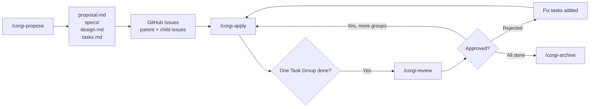
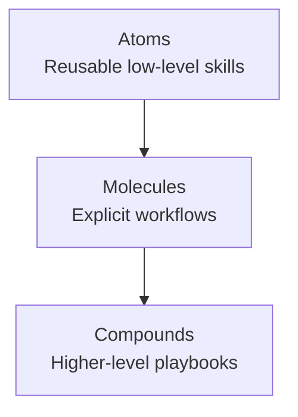

# OpenSpec GitHub Workflow Zhihu Article Design

**Date:** 2026-04-28
**Type:** Content design
**Format:** Zhihu article
**Positioning:** Promotion + practical onboarding

---

## Goal

Write a Zhihu article that introduces this repo as a GitHub-friendly extension of OpenSpec.

The article should help readers understand three things:

1. OpenSpec is a strong base for managing change artifacts.
2. This repo extends it into a workflow that better fits GitHub and day-to-day Git usage.
3. Ordinary developers can use the workflow, not only people who already build complex agent systems.

## Approved Direction

### Target readers

- AI and agent developers who already care about workflow quality
- Ordinary developers who want to adopt OpenSpec in a real GitHub-based project

### Core narrative

- **Primary narrative:** OpenSpec can be made usable for ordinary developers, not just advanced agent builders.
- **Supporting narrative:** The workflow is more practical because repeated work is reduced through reusable skills and structured workflow decomposition.

### Tone toward upstream OpenSpec

Use a friendly extension framing:

- OpenSpec is the base.
- This repo adds GitHub- and Git-friendly workflow capabilities on top.
- The article should not read like an attack on upstream.

## Claims the Article Should Make

These claims are grounded in this repo's current README and skill docs and are safe to promote:

- OpenSpec core handles change artifacts such as proposals, specs, design docs, and tasks.
- This repo adds custom schemas and skills on top of OpenSpec.
- The workflow supports GitHub-tracked and GitLab-tracked operation.
- For GitHub users, the tracked flow uses `gh` CLI and GitHub Issues.
- The workflow adds checkpoint-based apply: one Task Group at a time.
- The workflow adds an interactive review cycle: gather evidence first, then require an explicit approval or rejection decision.
- The workflow mirrors progress into tracked issues.
- The workflow uses label-based states such as `backlog -> todo -> in-progress -> review -> done`.
- The workflow can isolate each change in its own git worktree.
- The repo includes a project-local installer and a composable skill hierarchy.

## Claims the Article Should Avoid or Qualify

The article must stay accurate. Do not overstate the implementation.

- Do not present GitHub Project as the current system of record.
- Present GitHub Project as a possible board or management view, not the core tracked implementation.
- Describe the current GitHub path as GitHub Issues + labels + `gh` CLI + local artifacts.
- Do not imply that everything is fully autonomous. Human approval remains a real gate in review.

## Main Thesis

Recommended one-sentence thesis for the article:

> OpenSpec solves the artifact side of AI-assisted development, while this repo extends it into a GitHub-friendly engineering workflow that ordinary developers can actually run.

## Recommended Title Options

Use one of these as the article title. The first is recommended.

1. **Recommended:** How to Make OpenSpec Actually Work in a GitHub Workflow
2. OpenSpec Is Not Just for Writing Specs: Our GitHub-Friendly Workflow Extension
3. From Proposal to Review: An OpenSpec Workflow Ordinary Developers Can Use
4. How to Use OpenSpec Well: From Artifact Generation to GitHub Execution
5. Why We Extended OpenSpec for Real Git and GitHub Development

If the article is published in Chinese, the recommended localized title is:

**推荐标题：** `如何把 OpenSpec 真正用进 GitHub 工作流`

## Article Shape

The article should follow a promotion-plus-practical structure.

### Section 1. Opening hook: the real pain is not writing docs

Open with a concrete engineering pain point:

- Many people can generate `proposal.md`, `spec.md`, `design.md`, and `tasks.md`.
- The harder part is connecting those artifacts to issues, review, task-by-task execution, and Git isolation.
- Without that bridge, OpenSpec stops at planning instead of becoming an executable workflow.

Suggested hook sentence:

> The problem with AI development workflows is usually not that we cannot generate specs. The problem is that generated artifacts often never become a reliable GitHub execution flow.

### Section 2. What OpenSpec already does well

Frame OpenSpec positively:

- It gives a clean artifact pipeline.
- It gives a change lifecycle.
- It is a solid base for structured AI-assisted development.

This section should stay short. Its job is to establish respect for the upstream base.

### Section 3. What this repo adds on top

This is the main value section.

Organize the additions into a concise table:

| Base capability | This repo adds | Why GitHub users care |
|---|---|---|
| Change artifacts | `github-tracked` schema and GitHub issue sync | Artifacts are connected to live issue tracking |
| Planning only | Checkpoint-based apply | Execute one Task Group at a time instead of one giant step |
| Ad hoc review handoff | Interactive review cycle | Review becomes explicit, evidence-based, and human-gated |
| Local-only progress | Rich issue summaries and status sync | GitHub work stays visible to the whole team |
| Shared checkout | Git worktree isolation | Multiple changes can run in parallel without branch pollution |
| Flat or duplicated skills | Reusable skill hierarchy | Repeated work is reduced and workflow pieces can be reused |

### Section 4. Why reusable skills matter

This section is the method layer, but it should stay brief.

Use the repeated-work framing:

- In flat skill systems, each composite workflow tends to be rewritten from scratch.
- That creates repeated labor and makes GitHub/GitLab variants drift apart.
- The Atoms -> Molecules -> Compounds idea turns reusable low-level abilities into stable workflow building blocks.
- This matters because the workflow becomes easier to extend, validate, and keep consistent.

This section should connect directly back to reader value, not stay abstract for too long.

### Section 5. One practical GitHub example

Use a relatable feature example that already appears in the README:

`Add user authentication with JWT and refresh tokens`

Recommended walkthrough:

1. Run `/corgi-propose` to generate proposal, specs, design, and tasks.
2. Mirror the change into GitHub issues.
3. Run `/corgi-apply` to execute one Task Group.
4. Run `/corgi-review` to gather evidence and ask for an explicit decision.
5. If approved, continue with the next group; when all groups finish, run `/corgi-archive`.

The point of the example is not to teach every command flag. The point is to show that the workflow is staged, reviewable, and Git-friendly.

### Section 6. Show the flowchart

Include the workflow diagram below in the article.

The article can optionally add a second, smaller diagram for the skill hierarchy:

### Section 7. What GitHub users gain in practice

Close the body with concrete developer benefits:

- planning artifacts are no longer detached documents
- issue tracking reflects execution state
- review becomes a deliberate gate instead of a vague checkpoint
- multiple changes can stay isolated through worktrees
- workflow pieces become easier to reuse and maintain

### Section 8. Closing and call to action

End with a lightweight invitation:

- try the installer in a real repo
- start from one feature-sized change
- use the GitHub-tracked flow first

The CTA should feel practical rather than sales-heavy.

## Recommended Narrative Balance

Use this approximate balance:

- 20%: why the problem exists
- 20%: what OpenSpec already gives you
- 35%: what this repo changes for GitHub users
- 15%: one practical example
- 10%: reusable skill hierarchy and conclusion

This keeps the article readable for ordinary developers while still giving technical readers a strong methods story.

## Example Opening Paragraph

The final article does not need to use this verbatim, but it should keep the same angle:

> Many teams trying AI-assisted development can already generate specs, tasks, and design notes. But once the work enters GitHub, the process often falls apart: artifacts live in one place, issues live in another, review has no explicit gate, and parallel changes fight inside the same checkout. OpenSpec gives a strong artifact foundation. What we wanted was the missing layer that turns those artifacts into a GitHub-friendly engineering workflow.

## Writing Constraints

- Keep the article useful to ordinary developers.
- Avoid turning it into a feature dump.
- Avoid claiming GitHub Project-native automation unless the implementation actually supports it.
- Keep the upstream comparison respectful.
- Prefer one complete example over many shallow examples.

## Success Criteria

The article design is successful if a reader can answer yes to these questions after reading:

1. Do I understand what this repo adds on top of OpenSpec?
2. Do I understand why the workflow is more useful for GitHub-based development?
3. Can I picture how `propose -> apply -> review -> archive` works in practice?
4. Do I see why reusable skill composition reduces repeated workflow labor?
5. Do I feel that this is approachable enough to try in a normal project?

## Next Step

After review, use this design to draft the full Zhihu article in a separate markdown file.
